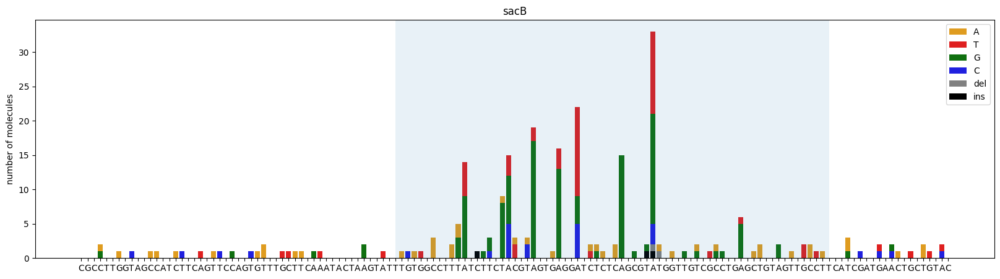

# dgrec


<!-- WARNING: THIS FILE WAS AUTOGENERATED! DO NOT EDIT! -->

## Overview

DGRec is a novel in vivo hypermutation technique that combines two
biological systems:

- **DGR** (Diversity Generating Retroelement): The DGR reverse
  transcriptase (bRT) + Avd reverse-transcribes a **Template Repeat
  (TR)** RNA sequence, introducing errors predominantly at **adenine
  positions**.
- **Recombineering** (CspRecT + mutL\*): The single-stranded recombinase
  CspRecT integrates the mutagenic cDNA into the **Variable Repeat
  (VR)** in a target gene, while mutL\* prevents mismatch repair from
  correcting the mutations.

This creates a powerful tool for targeted in vivo diversification in *E.
coli*, where adenine positions within the TR are selectively mutagenized
while other bases remain largely unchanged.

The [`dgrec`](https://dbikard.github.io/dgrec/API/cli.html#dgrec)
package provides tools to:

- **Call genotypes** from amplicon sequencing data (single-end or
  paired-end), with UMI-based deduplication to correct PCR and
  sequencing errors
- **Visualize mutation profiles** at nucleotide and amino acid
  resolution

**Publication:** [Targeted in vivo hypermutation with
DGRec](https://www.biorxiv.org/content/10.1101/2025.03.24.644984v1)

**Documentation:**
[dbikard.github.io/dgrec](https://dbikard.github.io/dgrec/)

## Install

We recommend installing dgrec in a dedicated conda environment:

``` sh
conda create -n dgrec python=3.11
conda activate dgrec
```

Install ViennaRNA (required for the TR scoring functions):

``` sh
conda install -c conda-forge -c bioconda viennarna
```

Then install dgrec:

``` sh
pip install git+https://github.com/dbikard/dgrec.git
```

## How to use

### Command line interface

#### Single reads

``` sh
dgrec genotypes fastq_path reference_path -o genotypes.csv
```

    Usage: dgrec genotypes [OPTIONS] FASTQ REF

    Options:
      -u, --umi_size INTEGER          Number of nucleotides at the beginning of
                                      the read that will be used as the UMI
      -q, --quality_threshold INTEGER
                                      threshold value used to filter out reads of
                                      poor average quality
      -i, --ignore_pos LIST           list of positions that are ignored in the
                                      genotype, e.g. [0,1,149,150]
      --match FLOAT                   match parameter of the aligner
      --mismatch FLOAT                mismatch parameter of the aligner
      --gap_open FLOAT                gap_open parameter of the aligner
      --gap_extend FLOAT              gap_extend parameter of the aligner
      -r, --reads_per_umi_thr INTEGER
                                      minimum number of reads required to take a
                                      UMI into account. Using a number >2 enables
                                      to perform error correction for UMIs with
                                      multiple reads
      -s, --save_umi_data TEXT        path to a csv file to save the details of
                                      the genotypes reads for each UMI. If None
                                      the data isn't saved.
      -o, --output TEXT               output file path
      --help                          Show this message and exit.

#### Paired reads

``` sh
dgrec genotypes_paired fwd_fastq_path rev_fastq_path reference_path --fwd_span 0 150 --rev_span 30 150 -o genotypes.csv
```

    Usage: dgrec genotypes_paired [OPTIONS] FASTQ_FWD FASTQ_REV REF

      Calls dgrec.genotypes_paired.get_genotypes_paired

    Options:
      --fwd_span <INTEGER INTEGER>...
                                      Span of the reference sequence read in the
                                      forward orientation format: start end
                                      [required]
      --rev_span <INTEGER INTEGER>...
                                      Span of the reference sequence read in the
                                      reverse orientation format: start end
                                      [required]
      -p, --require_perfect_pair_agreement
                                      Require perfect pair agreement for genotype
                                      calling (default: True).                  If
                                      set to False, the forward sequence will be
                                      used in case of disagreement.
      -u1, --umi_size_fwd INTEGER     Number of nucleotides at the beginning of
                                      the fwd read that will be used as the UMI
                                      (default: 10)
      -u2, --umi_size_rev INTEGER     Number of nucleotides at the beginning of
                                      the rev read that will be used as the UMI
                                      (default: 0)
      -q, --quality_threshold INTEGER
                                      Threshold value used to filter out reads of
                                      poor average quality (default: 30)
      -i, --ignore_pos LIST           List of positions that are ignored in the
                                      genotype (default: [])
      --match FLOAT                   match parameter of the aligner
      --mismatch FLOAT                mismatch parameter of the aligner
      --gap_open FLOAT                gap_open parameter of the aligner
      --gap_extend FLOAT              gap_extend parameter of the aligner
      -r, --reads_per_umi_thr INTEGER
                                      Minimum number of reads required to take a
                                      UMI into account (default: 0).
                                      Using a number >2 enables to perform error
                                      correction for UMIs with multiple reads
      -s, --save_umi_data TEXT        Path to a csv file to save the details of
                                      the genotypes reads for each UMI. If None
                                      the data isn't saved (default: None)
      -n INTEGER                      Number of reads to use. If None all the
                                      reads are used (default: None)
      -o, --output TEXT               Output file path
      --help                          Show this message and exit.

### In python

The package can also be used directly in Python for more flexibility.

#### Calling genotypes

Load a FASTQ file and a reference sequence, then call genotypes with UMI
deduplication. The `ignore_pos` parameter excludes positions at the
edges of the amplicon where sequencing quality is low.

``` python
import dgrec
```

``` python
from Bio import SeqIO
import os

#Getting the path to the fastq file
fastq_file="sacB_example.fastq.gz"
fastq_path=os.path.join(data_path,fastq_file)

#Getting the reference sequence for the amplicon
read_ref_file="sacB_ref.fasta"
ref=next(SeqIO.parse(os.path.join(data_path,read_ref_file),"fasta"))
ref_seq=str(ref.seq)

#Generating a list of genotypes sorted by the number of UMIs that are read for each genotype
gen_list = dgrec.get_genotypes(fastq_path, ref_seq, ignore_pos=[0,1,2,138,139,140,141])

#Printing the top results
for g in gen_list[:20]:
    print(f"{g[1]}\t{g[0]}")
```

    n reads:    1000
    n_reads pass filter:    847
    n_reads aligned:    824
    Number of UMIs: 814
    Median number of reads per UMI: 1.0
    Number of genotypes: 123
    675 
    3   C56A
    3   A76G
    3   A91G
    3   A91T
    2   C69T
    2   T122A
    2   A91C
    2   A105G
    2   C116A
    2   T60A
    2   T59A
    2   A68G
    2   T134A
    1   A61G,-63T,A76T,A91T
    1   A79T,A91G
    1   A61G,A72G,A76G,A79T
    1   T108A,G127T,G132T
    1   A48T,A86G
    1   A61T,A68T,A72G,A79C,A91G

Each genotype is represented as a comma-separated list of mutations in
the format `[RefBase][Position][AltBase]`. The list is sorted by the
number of UMI-deduplicated molecules supporting each genotype. The first
entry is typically the wild-type (unmutated) sequence.

#### Visualizing mutations

Plot mutation counts at each position. The shaded region indicates the
TR (Template Repeat) range where DGRec mutagenesis is active. Note the
strong enrichment of mutations at adenine positions within the TR — the
hallmark DGRec signature (in this example the TR was designed to have an
identical sequence to the VR).

``` python
fig = dgrec.plot_mutations(gen_list, ref_seq, sample_name="sacB", TR_range=[50,119])
```


